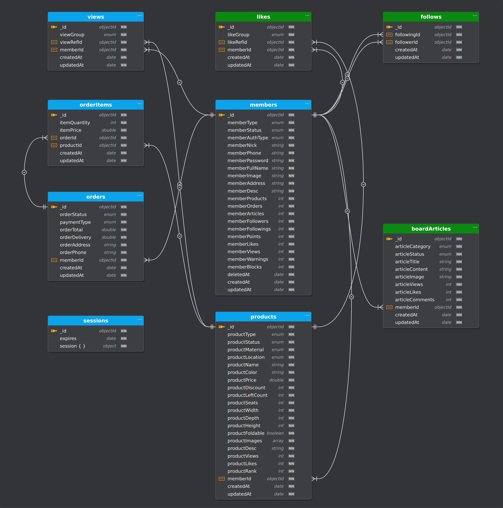
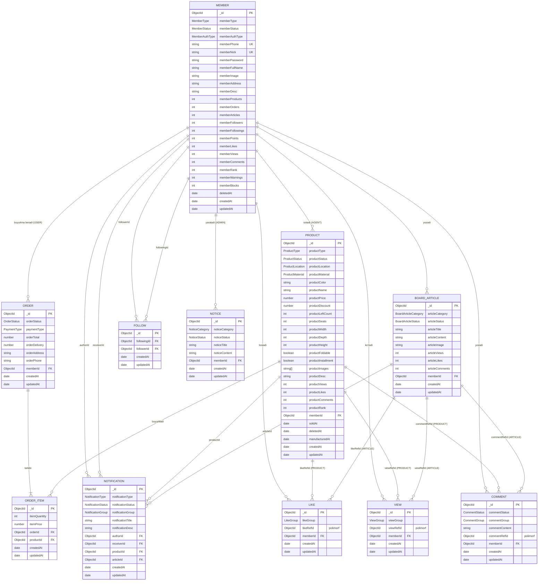

# Yumshoq Mebel Do'koni — ER Model

Bu model **Nestar** loyihasi arxitekturasi asosida tuzilgan (NestJS + GraphQL + MongoDB/Mongoose).
Nestar'dagi entitylar tuzilishi, nomlash uslubi (`propertyTitle` → `productName`), polimorf
`*RefId + *Group` bog'lanishlar va aggregatsiya hisoblagichlari (`*Views`, `*Likes`, `*Comments`)
o'zgarmagan holda saqlandi. `Property` o'rnini `Product` (yumshoq mebel) egalladi, do'kon uchun esa
`Order` va `OrderItem` qo'shildi.

> Manba: `yotoqxonacom-hub/Nestar-next` → `libs/types/*`, `libs/enums/*`.

## 1. Nestar → Mebel do'koni moslik jadvali

| Nestar                  | Mebel do'koni            | Izoh                                            |
|-------------------------|--------------------------|-------------------------------------------------|
| `Member`                | `Member`                 | USER = xaridor, AGENT = sotuvchi/diler, ADMIN   |
| `Property`              | `Product`                | Divan, kreslo, karavot, puf, matras...          |
| `propertyType`          | `productType`            | `ProductType` enum                              |
| `propertyLocation`      | `productLocation`        | Shourum joylashgan shahar                       |
| `propertySquare`        | `productWidth/Depth/Height` | O'lchamlar (sm)                              |
| `propertyBeds/Rooms`    | `productSeats`           | O'rindiqlar soni                                |
| `propertyBarter`        | `productFoldable`        | Yig'iladigan (raskladushka) mexanizm            |
| `propertyRent`          | `productInstallment`     | Bo'lib to'lash imkoniyati                       |
| `constructedAt`         | `manufacturedAt`         | Ishlab chiqarilgan sana                         |
| `BoardArticle`          | `BoardArticle`           | Hamjamiyat (interyer maslahatlari, yangiliklar) |
| `Comment / Like / View` | `Comment / Like / View`  | `PROPERTY` group → `PRODUCT`                    |
| `Follow`                | `Follow`                 | O'zgarishsiz                                    |
| `Notice`                | `Notice`                 | FAQ, TERMS, INQUIRY                             |
| `Notification`          | `Notification`           | `propertyId` → `productId`                      |
| —                       | **`Order`** (yangi)      | Buyurtma                                        |
| —                       | **`OrderItem`** (yangi)  | Buyurtmadagi mahsulotlar                        |

## 2. ER diagramma



Interaktiv versiya: [`er-diagram.html`](./er-diagram.html)

### Mermaid versiyasi



> **Polimorf bog'lanishlar** (Nestar'dagi kabi): `Like`, `View`, `Comment` bitta `*RefId` maydoni
> orqali turli kolleksiyalarga ishora qiladi, qaysi kolleksiya ekanini `*Group` enum belgilaydi.
> Masalan `likeGroup = PRODUCT` bo'lsa `likeRefId` → `products._id`,
> `likeGroup = MEMBER` bo'lsa → `members._id` (sotuvchini yoqtirish).
> `commentGroup = COMMENT` esa izohga javob (reply) degani.

## 3. Enumlar

```ts
// member.enum.ts
enum MemberType     { USER, AGENT, ADMIN }            // AGENT = sotuvchi / diler
enum MemberStatus   { ACTIVE, BLOCK, DELETE }
enum MemberAuthType { PHONE, EMAIL, TELEGRAM }

// product.enum.ts   (Nestar: property.enum.ts)
enum ProductType {
  SOFA,          // to'g'ri divan
  CORNER_SOFA,   // burchak divan
  ARMCHAIR,      // kreslo
  BED,           // yumshoq karavot
  POUF,          // puf
  MATTRESS,      // matras
  KIDS,          // bolalar yumshoq mebeli
}
enum ProductStatus   { ACTIVE, SOLD, DELETE }          // SOLD = omborda qolmagan
enum ProductMaterial { FABRIC, VELVET, MICROFIBER, LEATHER, ECO_LEATHER }
enum ProductLocation {
  TASHKENT, SAMARKAND, BUKHARA, ANDIJAN, FERGANA,
  NAMANGAN, NAVOI, KASHKADARYA, SURKHANDARYA, KHOREZM, JIZZAKH, SIRDARYA, KARAKALPAKSTAN,
}

// order.enum.ts   (yangi)
enum OrderStatus { PAUSE, PROCESS, DELIVERY, FINISH, CANCEL, DELETE }
enum PaymentType { CASH, CARD, INSTALLMENT }

// board-article.enum.ts
enum BoardArticleCategory { FREE, RECOMMEND, NEWS, INTERIOR }
enum BoardArticleStatus   { ACTIVE, DELETE }

// comment.enum.ts
enum CommentStatus { ACTIVE, DELETE }
enum CommentGroup  { MEMBER, ARTICLE, PRODUCT, COMMENT }

// like.enum.ts / view.enum.ts
enum LikeGroup { MEMBER, PRODUCT, ARTICLE }
enum ViewGroup { MEMBER, ARTICLE, PRODUCT }

// notice.enum.ts
enum NoticeCategory { FAQ, TERMS, INQUIRY }
enum NoticeStatus   { HOLD, ACTIVE, DELETE }

// notification.enum.ts
enum NotificationType   { LIKE, COMMENT, FOLLOW, ORDER }
enum NotificationStatus { WAIT, READ }
enum NotificationGroup  { MEMBER, ARTICLE, PRODUCT, ORDER }
```

## 4. Bog'lanishlar (kardinallik)

| Bog'lanish                          | Turi  | Izoh                                                 |
|-------------------------------------|-------|------------------------------------------------------|
| Member (AGENT) → Product            | 1 : N | Bitta sotuvchi ko'p mahsulot joylaydi                |
| Member (USER) → Order               | 1 : N | Xaridor ko'p buyurtma beradi                         |
| Order → OrderItem                   | 1 : N | Buyurtmada kamida bitta mahsulot bo'ladi             |
| Product → OrderItem                 | 1 : N | Order ↔ Product o'rtasidagi M : N ni ajratadi        |
| Member → BoardArticle               | 1 : N |                                                      |
| Member ↔ Member (Follow)            | M : N | `followerId` → `followingId`                          |
| Member → Like / View / Comment      | 1 : N |                                                      |
| Product / Article / Member → Like   | 1 : N | polimorf (`likeRefId` + `likeGroup`)                 |
| Product / Article / Member → View   | 1 : N | polimorf (`viewRefId` + `viewGroup`)                 |
| Product / Article / Member / Comment → Comment | 1 : N | polimorf (`commentRefId` + `commentGroup`) |
| Member (ADMIN) → Notice             | 1 : N |                                                      |
| Member → Notification               | 1 : N | `authorId` (kim), `receiverId` (kimga)               |

## 5. Indekslar (Mongoose)

```ts
// MemberSchema
memberNick:  { unique: true }
memberPhone: { unique: true }

// ProductSchema — bir xil mahsulot ikki marta joylanmasligi uchun (Nestar'dagi kabi)
ProductSchema.index(
  { productType: 1, productLocation: 1, productName: 1, productPrice: 1 },
  { unique: true },
);

// LikeSchema / ViewSchema — bitta foydalanuvchi bitta obyektni 1 marta like/view qiladi
LikeSchema.index({ memberId: 1, likeRefId: 1 }, { unique: true });
ViewSchema.index({ memberId: 1, viewRefId: 1 }, { unique: true });

// FollowSchema
FollowSchema.index({ followingId: 1, followerId: 1 }, { unique: true });

// OrderItemSchema
OrderItemSchema.index({ orderId: 1, productId: 1 }, { unique: true });
```

## 6. Biznes qoidalari

- Faqat `memberType = AGENT` (yoki `ADMIN`) mahsulot yarata oladi; `USER` buyurtma beradi.
- Buyurtma yaratilganda `OrderItem.itemPrice` o'sha paytdagi `productPrice` (chegirma bilan)
  qiymatida saqlanadi — keyinchalik narx o'zgarsa ham buyurtma summasi o'zgarmaydi.
- `orderTotal = Σ(itemQuantity × itemPrice) + orderDelivery`.
- Buyurtma `PROCESS` holatiga o'tganda `productLeftCount` kamayadi; `0` bo'lsa
  `productStatus = SOLD` va `soldAt` belgilanadi.
- `productViews`, `productLikes`, `productComments`, `memberFollowers` va h.k. —
  Nestar'dagi kabi `$inc` orqali yangilanadigan denormalizatsiyalangan hisoblagichlar.
- O'chirish yumshoq (soft delete): `*Status = DELETE` va `deletedAt`.

## 7. Kolleksiyalar (MongoDB)

`members`, `products`, `orders`, `orderItems`, `boardArticles`, `comments`, `likes`, `views`,
`follows`, `notices`, `notifications`
